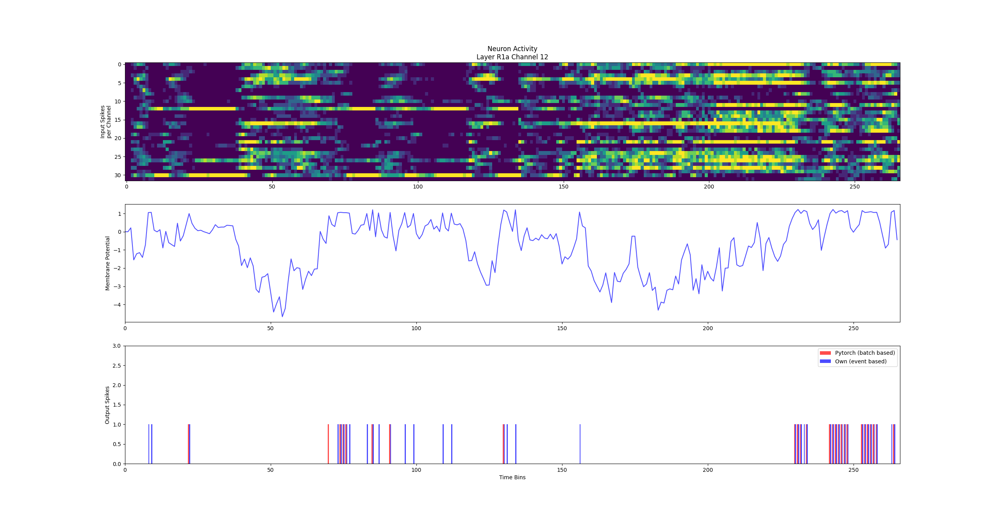

# Layer Comparision

This document contains tests and results comparing the spiking behaviour and neuron activity of the layers introduced in this implementation to the [pytorch implementation](https://github.com/tudelft/event_flow), which was used as a reference. The input sequences used are taken from the pytorch implementation to make for a more representative comparison. Since the pytorch implementation uses an event window or batch aproach and omits time information of the input spikes, they needed to be converted in a way where for each new event window the timestamp is increased by 100us as time information is needed for the new single spike based aproach.

The following parameters were used for testing:

```python
LOG_BINSIZE = 100
LEAK_RATE = 0.17 * LOG_BINSIZE
U_RESET = 0
REC_DELAY = 100
REFRACTORY_PERIOD = 50
```

## Head Layer

```python
channel = 1
x_pos = 7
y_pos = 2
```

### Learned Thresholds

|         | Channel 1 | Layer |
|---------|-----------|-------|
| Hamming |0.003788|0.009706|
| Jaccard |0.023256|0.146429|


### Threshold 0.68

|         | Channel 1 | Layer |
|---------|-----------|-------|
| Hamming |0.037879|0.019650|
| Jaccard |0.227273|0.270799|

[Head Layer Activity](head_out_1_t0-68.png)

[Threshold Test head](thresh_head.png)

## G1 Layer

```python
channel = 18
x_pos = 7
y_pos = 2
```

|         | Channel 18 | Layer |
|---------|-----------|-------|
| Hamming |0.492424|0.299598|
| Jaccard |0.742857|0.617016|


[Threshold Test G1](thresh_G1.png)

## R1a Layer


```python
channel = 12
x_pos = 1
y_pos = 3
```

### Learned Thresholds

|         | Channel 12 | Layer |
|---------|-----------|-------|
| Hamming | 0.165414 | 0.116776 |
| Jaccard | 0.628571 | 0.370896 |


### Threshold 1.00

|         | Channel 12 | Layer |
|---------|-----------|-------|
| Hamming | 0.060150 | 0.075188 |
| Jaccard | 0.390244 | 0.293713 |



[Threshold Test R1a](thresh_R1a.png)

## R1b Layer

### Learned Thresholds

```python
channel = 10
x_pos = 1
y_pos = 3
```

|         | Channel 10 | Layer |
|---------|-----------|-------|
| Hamming | 0.015038 | 0.121711 |
| Jaccard | 0.142857 | 0.423203 |


### Threshold 1.00

|         | Channel 10 | Layer |
|---------|-----------|-------|
| Hamming | 0.015038 | 0.079065 |
| Jaccard | 0.153846 | 0.345305 |

[R1b Layer Activity](R1b_out_10_t1-00.png)

[Threshold Test R1b](thresh_R1b.png)

## Discussion

- Spiking activity in convolutional layers is roughly matching the pytorch implementation
- Spiking activity in recurrent convolutional layers is barely matching
- Learned thresholds are only beneficial for head Layer

Problems:

- Adding time information to iterative spike batches might be inaccurate
- Rec layers are missing inputs from outside their kernel window
  - Spikes outside of the kernel widndows might lead to recurrent spikes inside the kernel window
- Weights might need normalisation (recurrent Kernels are dominating input)
