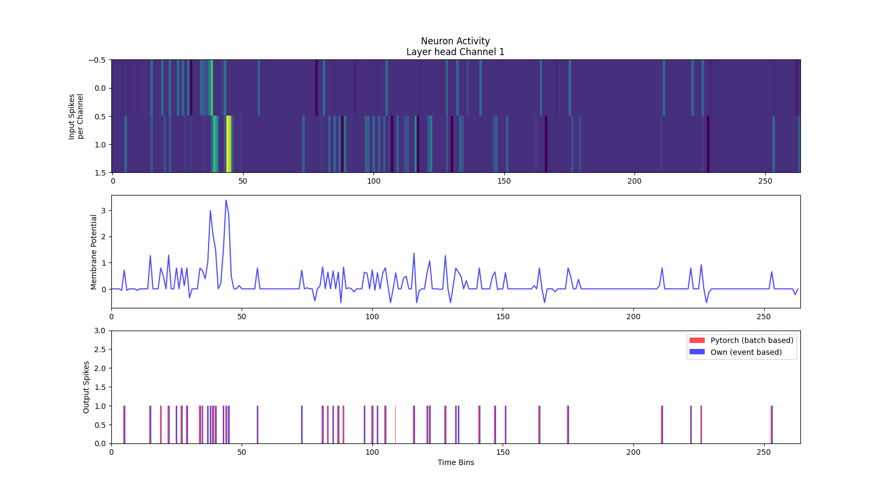
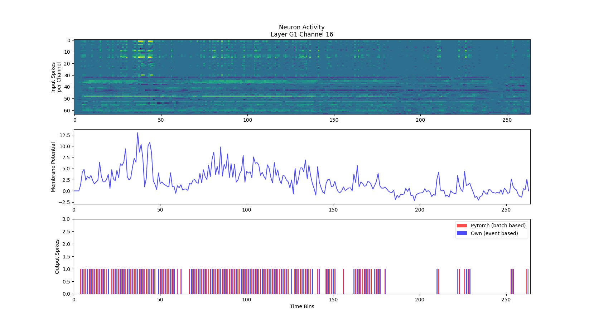
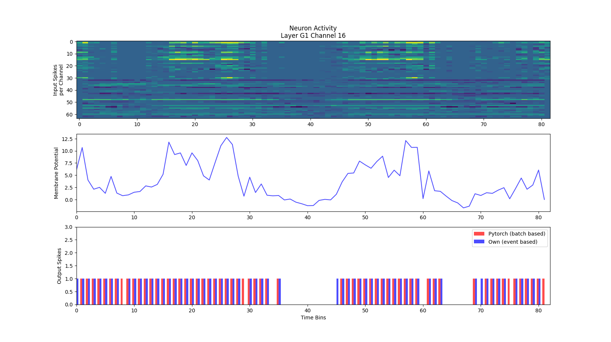
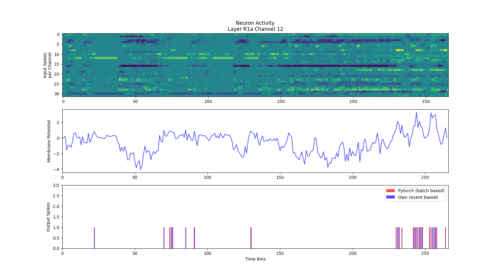
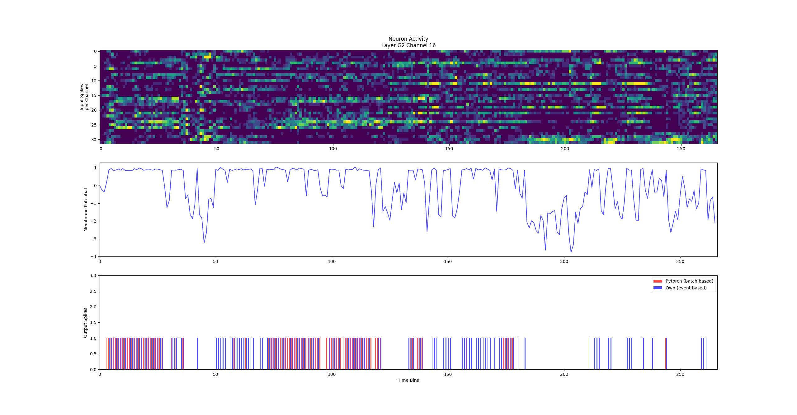

# Layer Comparision

This document contains tests and results comparing the spiking behaviour and neuron activity of the layers introduced in this implementation to the [pytorch implementation](https://github.com/tudelft/event_flow), which was used as a reference. The input sequences used are taken from the pytorch implementation to make for a more representative comparison. Since the pytorch implementation uses an event window or batch aproach and omits time information of the input spikes, they needed to be converted in a way where for each new event window the timestamp is increased by 100us as time information is needed for the new single spike based aproach.

The following parameters were used for testing:

```python
LOG_BINSIZE = 100
LEAK_RATE = 0.17 * LOG_BINSIZE
U_RESET = 0
REC_DELAY = 100
REFRACTORY_PERIOD = 50
```

## Head Layer

```python
channel = 1
x_pos = 7
y_pos = 2
```

|         | Channel 1 | Layer |
|---------|-----------|-------|
| Hamming |0.003788|0.000829|
| Jaccard |0.023256|0.014199|




[Threshold Test head](thresh_head.png)

## G1 Layer

```python
channel = 16
x_pos = 7
y_pos = 2
```

### Extracted Recurrent Spikes

|         | Channel 16 | Layer |
|---------|-----------|-------|
| Hamming |0.003788|0.001776|
| Jaccard |0.006173|0.005155|




### Generated Recurrent Spikes

32x32 Cropped h5 file

x = [240:272]
y = [10:42]
N = [16,16]

|         | Channel 16 | Layer |
|---------|-----------|-------|
| Hamming |0.073171|0.079649|
| Jaccard |0.090909|0.191217|



## R1a Layer


```python
channel = 12
x_pos = 1
y_pos = 3
```

|         | Channel 12 | Layer |
|---------|-----------|-------|
| Hamming | 0.000000 | 0.000470 |
| Jaccard | 0.000000 | 0.002358 |



## R1b Layer

### Learned Thresholds

```python
channel = 10
x_pos = 1
y_pos = 3
```

|         | Channel 10 | Layer |
|---------|-----------|-------|
| Hamming | 0.000000 | 0.000822 |
| Jaccard | 0.000000 | 0.004871 |


## G2 Layer

```python
channel = 16
x_pos = 7
y_pos = 2
```

### Learned Thresholds

|         | Channel 16 | Layer |
|---------|-----------|-------|
| Hamming | 0.165414 | 0.140038 |
| Jaccard | 0.335878 | 0.363969 |



### Threshold 1.20

|         | Channel 16 | Layer |
|---------|-----------|-------|
| Hamming | 0.078947 | 0.082589 |
| Jaccard | 0.196262 | 0.266389 |


[G2 Layer Activity](G2_out_16_t1-20.png)

## Discussion

- Spiking activity in convolutional layers is matching the pytorch implementation
- Spiking activity in recurrent convolutional layers is matching with extracted recurrent spikes
- Learned thresholds are only beneficial for head Layer
- Rec layers are missing inputs from outside their kernel window
  - Spikes outside of the kernel widndows might lead to recurrent spikes inside the kernel window
  - Therefore all neighbouring output spikes of the recurrent layer need to be recorded to be used as recurrent input


Problems:

- Adding time information to iterative spike batches might be inaccurate