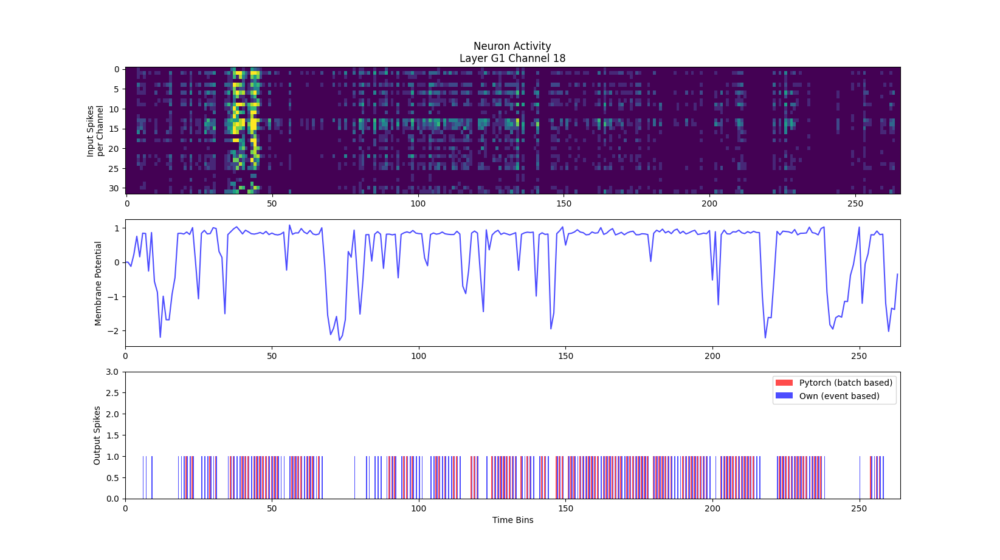

# Layer Comparision

This document contains tests and results comparing the spiking behaviour and neuron activity of the layers introduced in this implementation to the [pytorch implementation](https://github.com/tudelft/event_flow), which was used as a reference. The input sequences used are taken from the pytorch implementation to make for a more representative comparison. Since the pytorch implementation uses an event window or batch aproach and omits time information of the input spikes, they needed to be converted in a way where for each new event window the timestamp is increased by 100us as time information is needed for the new single spike based aproach.

The following parameters were used for testing:
```python
LOG_BINSIZE = 100
LEAK_RATE = 0.17 * LOG_BINSIZE
U_RESET = 0
REC_DELAY = 100
REFRACTORY_PERIOD = 50
```

## Head Layer

Channel 1
- H: 0.087121
- J: 0.500000

Layer head
- H: 0.054806
- J: 0.649369

```python
U_THRESH = 0.74

channel = 1
x_pos = 7
y_pos = 2
```


## G1 Layer

Channel 18
- H: 0.556818
- J: 0.761658

Layer G1
- H: 0.333215
- J: 0.677171

```python
U_THRESH = 1.0

channel = 18
x_pos = 7
y_pos = 2
```




## R1a Layer

Channel 12
- H: 0.112782
- J: 0.588235

Layer R1a
- H: 0.166471
- J: 0.559637


```python
U_THRESH = 1.0

channel = 12
x_pos = 1
y_pos = 3
```


## R1b Layer

Channel 10
- H: 0.139098
- J: 0.770833

Layer R1b
- H: 0.183976
- J: 0.680278

```python
U_THRESH = 1.0

channel = 10
x_pos = 1
y_pos = 3
```


## Discussion

- Spiking activity in convolutional layers is vaguely matching the pytorch implementation
- Spiking activity in recurrent convolutional layers is barely matching

Problems:
- Adding time information to iterative spike batches might be inaccurate
- Rec layers are missing inputs from outside their kernel window
  - Spikes outside of the kernel widndows might lead to recurrent spikes inside the kernel window
- Weights might need normalisation (recurrent Kernels are dominating input)
- Using learned thresholds per kernel might improve similarity